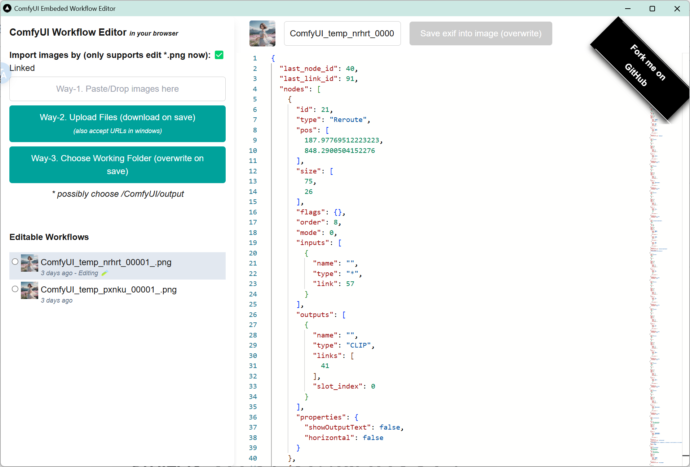

# ComfyUI embedded workflow editor

In-place embedded workflow-exif editing experience for ComfyUI generated images. Edit png exif just in your browser.

## Usage

Open https://comfyui-embeded-workflow-editor.vercel.app/

## Roadmap

- [ ] Support for more image formats (png, jpg, webp, etc)
    - [x] png
    - [ ] webp (coming soon)
    - [ ] jpg (seems not possible yet)
- [x] Show preview img to ensure you are editing the right image (thumbnail)
- [ ] Support for other exif tags ("prompt", ...)

## Contributing

repo: https://github.com/snomiao/ComfyUI-embeded-workflow-editor

## About

@snomiao 2024

## License

MIT